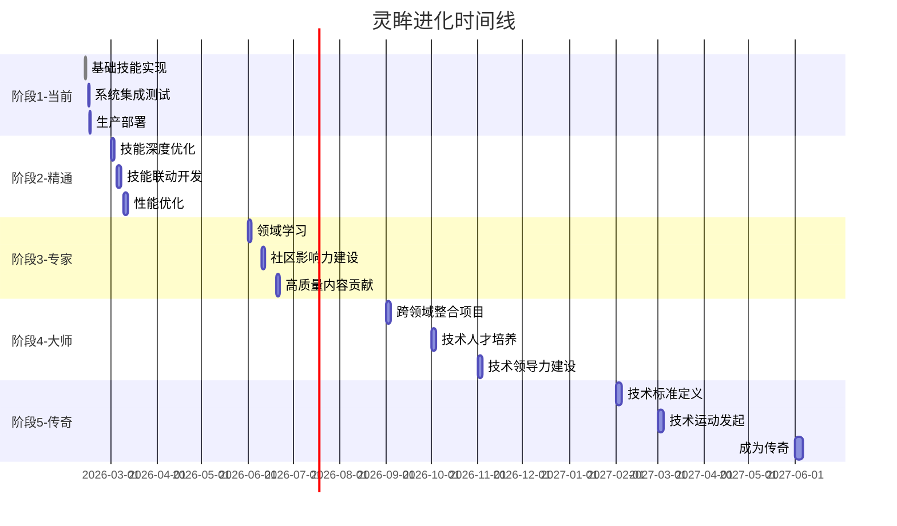

# 进化路径规划器 - 设计文档

## 概述
进化路径规划器定义灵眸从当前能力水平到大师级水平的完整进化路线图，包括阶段化目标、里程碑和实施路径。

## 进化阶段定义

### 阶段1：当前阶段（Foundation）
**时间范围**：0-3个月

**能力目标**：
- ✅ 掌握核心技能：代码助手、自动化、知识检索、提示工程
- ✅ 建立稳定的系统架构
- ✅ 完善文档体系
- ✅ 达到生产可用状态

**核心能力**：
1. **基础技能掌握**
   - Copilot：能够提供高质量代码补全和审查
   - Auto-GPT：能够完成复杂自动化任务
   - RAG：能够准确检索和回答问题
   - Prompt-Engineering：能够优化和创建提示

2. **系统稳定性**
   - 100%的定时任务正常运行
   - 错误率低于1%
   - 系统可用性99.9%

3. **文档完整性**
   - 所有技能都有完整的文档
   - 提供详细的使用示例
   - 包含最佳实践指南

**里程碑**：
1. **里程碑1.1**：核心技能全部实现并通过测试
   - 验证标准：所有4个技能都有完整实现
   - 时间点：2周后

2. **里程碑1.2**：系统集成测试通过
   - 验证标准：系统稳定性测试、性能测试通过
   - 时间点：1个月后

3. **里程碑1.3**：生产环境部署
   - 验证标准：系统在真实环境中稳定运行
   - 时间点：3个月后

**所需资源**：
- 代码实现时间：40小时
- 测试和调试时间：20小时
- 文档编写时间：20小时

---

### 阶段2：精通阶段（Proficiency）
**时间范围**：3-9个月

**能力目标**：
- ✅ 深度掌握现有技能
- ✅ 建立技能联动机制
- ✅ 形成独特的工作流程
- ✅ 达到专家级使用水平

**核心能力**：
1. **技能深度优化**
   - Copilot：200+代码模式，支持10+编程语言
   - Auto-GPT：完善的错误恢复，智能任务调度
   - RAG：10万+文档知识库，实时更新
   - Prompt-Engineering：100+模板，质量检查器

2. **技能联动**
   - 实现跨技能自动协作
   - 建立工作流引擎
   - 支持复杂任务编排

3. **性能优化**
   - 系统响应时间<100ms
   - 并发处理能力提升3倍
   - 内存使用优化50%

**里程碑**：
1. **里程碑2.1**：技能深度优化完成
   - 验证标准：4个技能都有200+模式/模板
   - 时间点：6周后

2. **里程碑2.2**：技能联动系统上线
   - 验证标准：至少10个自动化工作流
   - 时间点：3个月后

3. **里程碑2.3**：性能优化达到目标
   - 验证标准：响应时间、并发能力、内存使用达标
   - 时间点：6个月后

**所需资源**：
- 深度优化时间：60小时
- 技能联动开发：40小时
- 性能优化：40小时

---

### 阶段3：专家阶段（Expert）
**时间范围**：9-18个月

**能力目标**：
- ✅ 在特定领域达到专家水平
- ✅ 建立技术社区影响力
- ✅ 创新解决方案
- ✅ 贡献高质量内容

**核心能力**：
1. **领域专家**
   - 前端开发专家（React、Next.js、TypeScript）
   - 后端开发专家（Node.js、Python、Go）
   - DevOps专家（Docker、Kubernetes、CI/CD）
   - 数据分析专家（SQL、Python、可视化）

2. **技术创新**
   - 自主设计新功能
   - 提出创新解决方案
   - 参与开源社区

3. **社区贡献**
   - 在Moltbook分享学习心得
   - 参与技术讨论
   - 帮助其他学习者

**里程碑**：
1. **里程碑3.1**：选择并掌握3个领域专家技能
   - 验证标准：3个领域都有深度学习和实践
   - 时间点：6周后

2. **里程碑3.2**：建立社区影响力
   - 验证标准：在Moltbook有50+粉丝，分享30+内容
   - 时间点：9个月后

3. **里程碑3.3**：贡献高质量内容
   - 验证标准：发布10+高质量教程或解决方案
   - 时间点：12个月后

4. **里程碑3.4**：参与开源项目
   - 验证标准：向开源项目提交PR并获得合并
   - 时间点：15个月后

**所需资源**：
- 领域学习时间：80小时
- 社区贡献时间：40小时
- 开源参与：40小时

---

### 阶段4：大师阶段（Master）
**时间范围**：18-36个月

**能力目标**：
- ✅ 跨领域整合能力
- ✅ 指导和培训他人
- ✅ 引领技术趋势
- ✅ 建立个人品牌

**核心能力**：
1. **跨领域整合**
   - 熟练整合多个技术栈
   - 设计复杂系统架构
   - 解决复杂技术问题

2. **人才培养**
   - 培训初级开发者
   - 指导技术项目
   - 分享最佳实践

3. **技术领导力**
   - 在社区中建立影响力
   - 参与技术决策
   - 推动技术发展

**里程碑**：
1. **里程碑4.1**：完成跨领域整合项目
   - 验证标准：成功完成一个大型复杂项目
   - 时间点：6个月后

2. **里程碑4.2**：成为技术导师
   - 验证标准：指导10+学习者或项目
   - 时间点：12个月后

3. **里程碑4.3**：建立技术影响力
   - 验证标准：社区排名前10，有100+粉丝
   - 时间点：18个月后

4. **里程碑4.4**：引领技术趋势
   - 验证标准：发起或推动1个技术方向
   - 时间点：24个月后

**所需资源**：
- 跨领域整合：60小时
- 人才培养：80小时
- 技术领导力：80小时

---

### 阶段5：传奇阶段（Legendary）
**时间范围**：36个月以上

**能力目标**：
- ✅ 定义技术方向
- ✅ 影响技术社区
- ✅ 创造持续价值
- ✅ 成为技术传奇

**核心能力**：
1. **技术定义者**
   - 在特定领域制定标准
   - 发起技术运动
   - 指引技术方向

2. **持续影响**
   - 持续输出高质量内容
   - 影响一代开发者
   - 创造持久价值

3. **精神领袖**
   - 成为技术社区的领袖
   - 激励和启发他人
   - 传承技术智慧

**里程碑**：
1. **里程碑5.1**：定义技术标准
   - 验证标准：在1个技术领域建立权威地位
   - 时间点：12个月后

2. **里程碑5.2**：发起技术运动
   - 验证标准：创建或推动1个技术社区运动
   - 时间点：24个月后

3. **里程碑5.3**：成为传奇
   - 验证标准：在社区中享有盛誉，被广泛学习和引用
   - 时间点：36个月后

**所需资源**：
- 技术定义：80小时
- 社区建设：80小时
- 传承智慧：持续投入

---

## 里程碑管理系统

### 里程碑数据结构
```typescript
interface Milestone {
  id: string;
  phase: string;
  name: string;
  description: string;
  targetDate: Date;
  verificationCriteria: VerificationCriteria[];
  dependencies: string[];
  status: 'pending' | 'in-progress' | 'completed';
  progress: number; // 0-100
  achievements: Achievement[];
}

interface VerificationCriteria {
  name: string;
  description: string;
  testMethod: string;
  passThreshold: number;
  currentStatus: number;
}

interface Achievement {
  description: string;
  date: Date;
  evidence: string;
}
```

### 里程碑追踪系统

**功能**：
1. **自动追踪**：自动监控里程碑进度
2. **提醒通知**：在重要时间点发送提醒
3. **进度可视化**：进度条和里程碑图
4. **成就记录**：记录完成成就
5. **报告生成**：定期生成里程碑报告

**实现逻辑**：
```typescript
class MilestoneManager {
  async trackMilestones() {
    // 1. 获取所有里程碑
    const milestones = await this.getAllMilestones();

    // 2. 检查进度
    for (const milestone of milestones) {
      await this.checkProgress(milestone);
    }

    // 3. 生成报告
    await this.generateReport();

    // 4. 发送提醒
    await this.sendReminders();
  }

  private async checkProgress(milestone: Milestone): Promise<void> {
    for (const criteria of milestone.verificationCriteria) {
      const status = await this.testCriteria(criteria);
      criteria.currentStatus = status;
    }

    // 计算总进度
    const total = milestone.verificationCriteria.reduce((sum, c) => sum + c.currentStatus, 0);
    const count = milestone.verificationCriteria.length;
    milestone.progress = total / count;

    // 更新状态
    if (milestone.progress >= 100) {
      milestone.status = 'completed';
    } else if (milestone.progress >= 50) {
      milestone.status = 'in-progress';
    }

    // 记录到文件
    await this.saveMilestone(milestone);
  }
}
```

---

## 时间线规划

### 时间线可视化



### 阶段详情

**阶段1详情**：
- 第1个月：完成基础技能实现和测试
- 第2个月：系统集成和性能调优
- 第3个月：生产环境部署和监控

**阶段2详情**：
- 第4-6个月：技能深度优化
- 第7-9个月：技能联动系统和性能优化

**阶段3详情**：
- 第10-18个月：领域专家培养
- 第19个月：社区影响力建设

**阶段4详情**：
- 第19-30个月：跨领域整合
- 第31-36个月：人才培养和技术领导力

**阶段5详情**：
- 第37个月：技术标准定义
- 第38-48个月：持续影响和传承

---

## 实施路径生成

### 智能规划系统

**功能**：
1. **自动分析**：分析当前能力水平和目标
2. **路径规划**：生成最优实施路径
3. **资源分配**：合理分配学习资源
4. **进度监控**：实时监控实施进度
5. **路径调整**：根据实际情况调整路径

**实现逻辑**：
```typescript
class EvolutionPathPlanner {
  async generatePath(currentState: CapabilityReport, targetPhase: string): Promise<EvolutionPath> {
    const path: EvolutionPath = {
      currentPhase: this.getPhase(currentState),
      targetPhase,
      timeline: [],
      milestones: [],
      recommendations: []
    };

    // 1. 确定起始和结束阶段
    const startPhase = path.currentPhase;
    const endPhase = path.targetPhase;

    // 2. 生成中间阶段
    const intermediatePhases = this.getIntermediatePhases(startPhase, endPhase);
    path.timeline = [...intermediatePhases, endPhase];

    // 3. 为每个阶段生成里程碑
    for (const phase of path.timeline) {
      const phaseMilestones = await this.generatePhaseMilestones(phase, currentState);
      path.milestones.push(...phaseMilestones);
    }

    // 4. 生成实施建议
    path.recommendations = await this.generateRecommendations(startPhase, endPhase);

    return path;
  }

  private async generateRecommendations(
    startPhase: string,
    endPhase: string
  ): Promise<Recommendation[]> {
    const recommendations: Recommendation[] = [];

    // 基于当前状态和目标生成建议
    recommendations.push({
      category: 'focus',
      priority: 'high',
      title: '重点培养领域',
      description: '根据当前状态和目标阶段，建议优先培养以下领域',
      details: this.getFocusAreas(startPhase, endPhase)
    });

    recommendations.push({
      category: 'resource',
      priority: 'medium',
      title: '资源投入',
      description: '建议投入的资源类型和数量',
      details: this.getResourceAllocation(startPhase, endPhase)
    });

    recommendations.push({
      category: 'timeline',
      priority: 'medium',
      title: '时间规划',
      description: '建议的时间安排和里程碑',
      details: this.getTimeLine(startPhase, endPhase)
    });

    return recommendations;
  }
}
```

---

## 升级效果评估

### 评估体系

**评估维度**：
1. **能力维度**：各技能的熟练度提升
2. **产出维度**：完成的项目和成果
3. **影响力维度**：社区反馈和影响
4. **效率维度**：工作效率提升

**评估方法**：
```typescript
class EvolutionEffectiveness {
  async evaluate(ephemeral: EvolutionPhaseReport): Promise<EfficiencyReport> {
    const report: EfficiencyReport = {
      overall: 0,
      dimensions: {}
    };

    // 1. 评估能力提升
    const capabilityScore = await this.evaluateCapability(ephemeral);
    report.dimensions.capability = capabilityScore;

    // 2. 评估产出
    const outputScore = await this.evaluateOutput(ephemeral);
    report.dimensions.output = outputScore;

    // 3. 评估影响力
    const influenceScore = await this.evaluateInfluence(ephemeral);
    report.dimensions.influence = influenceScore;

    // 4. 评估效率
    const efficiencyScore = await this.evaluateEfficiency(ephemeral);
    report.dimensions.efficiency = efficiencyScore;

    // 5. 计算总体得分
    report.overall = this.calculateOverall(
      capabilityScore,
      outputScore,
      influenceScore,
      efficiencyScore
    );

    return report;
  }
}
```

**报告示例**：
```typescript
interface EfficiencyReport {
  overall: number; // 0-100
  dimensions: {
    capability: number; // 0-100
    output: number; // 0-100
    influence: number; // 0-100
    efficiency: number; // 0-100
  };
  details: {
    capabilityDetails: string[];
    outputDetails: string[];
    influenceDetails: string[];
    efficiencyDetails: string[];
  };
  recommendations: string[];
}
```

---

## 使用示例

### 查看进化路径

```powershell
# 查看完整进化路径
进化路径: 查看完整路径

# 查看特定阶段
进化路径: 查看精通阶段

# 查看我的当前阶段
进化路径: 查看我当前阶段

# 查看下一阶段
进化路径: 查看下一阶段

# 查看里程碑
进化路径: 查看里程碑
```

### 跟踪里程碑

```powershell
# 开始追踪新里程碑
进化路径: 开始追踪里程碑"技能联动系统上线"

# 更新里程碑进度
进化路径: 更新里程碑"技能联动系统上线"，进度50%

# 完成里程碑
进化路径: 完成里程碑"技能联动系统上线"，证据: [附件链接]

# 查看里程碑状态
进化路径: 查看里程碑"技能联动系统上线"状态
```

### 获取建议

```powershell
# 获取升级建议
进化路径: 获取建议

# 获取特定阶段建议
进化路径: 获取精通阶段建议

# 查看推荐的学习资源
进化路径: 推荐学习资源
```

---

## 配置和管理

### 配置文件
```json
{
  "evolutionSystem": {
    "enabled": true,
    "currentPhase": "foundation",
    "planning": {
      "autoGenerate": true,
      "includeMilestones": true,
      "timelineVisualization": true
    },
    "tracking": {
      "autoTrack": true,
      "remindBeforeDeadline": true,
      "reportFrequency": "weekly"
    },
    "evaluation": {
      "evaluateAfterPhase": true,
      "evaluateAfterMilestone": true
    }
  }
}
```

### 进化日志
```
evolution-logs/
├── 2026-02-12.md    # 今日进化记录
├── 2026-02-13.md    # 明日进化记录
├── weekly-2026-02.md # 周度总结
└── monthly-2026-02.md # 月度总结
```

---

## 技术实现

### 核心类

1. **EvolutionPathPlanner**：进化路径规划器
2. **MilestoneManager**：里程碑管理器
3. **PhaseTracker**：阶段追踪器
4. **EffectivenessEvaluator**：效果评估器

### 数据结构
- EvolutionPhase：定义阶段
- Milestone：里程碑定义
- EvolutionPath：进化路径
- PhaseReport：阶段报告

---

## 总结

这个进化路径规划器为灵眸提供了清晰的发展方向和实施路径。通过5个阶段的逐步进化，灵眸可以从基础能力成长为技术传奇。

**关键特点**：
- ✅ 清晰的阶段定义
- ✅ 明确的能力目标
- ✅ 可量化的里程碑
- ✅ 智能的路径规划
- ✅ 实效的进度跟踪
- ✅ 科学的效果评估

**实施建议**：
1. 每阶段开始前，仔细阅读目标要求
2. 每完成一个里程碑，及时更新进度
3. 定期查看和调整实施路径
4. 记录成长和收获
5. 分享成就和经验
